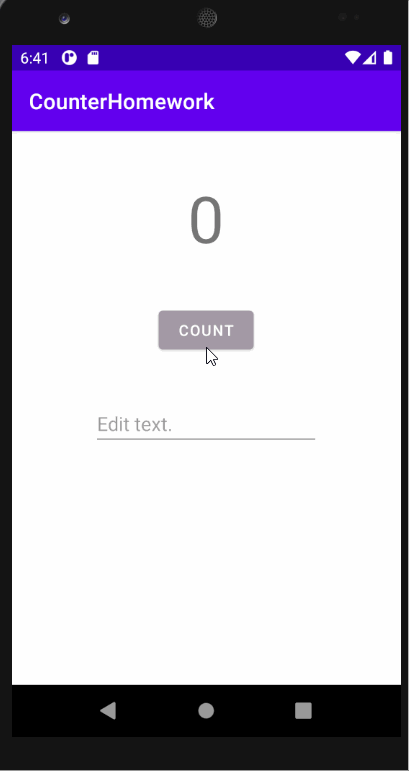
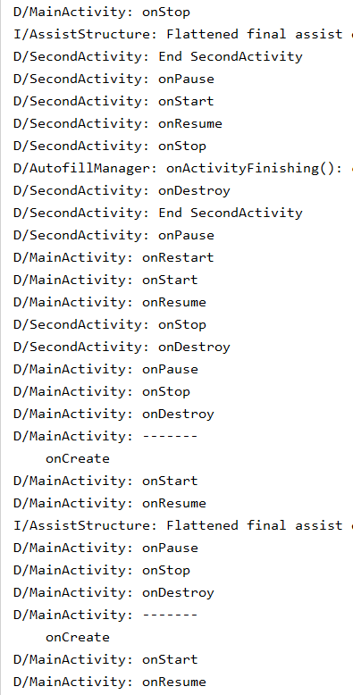
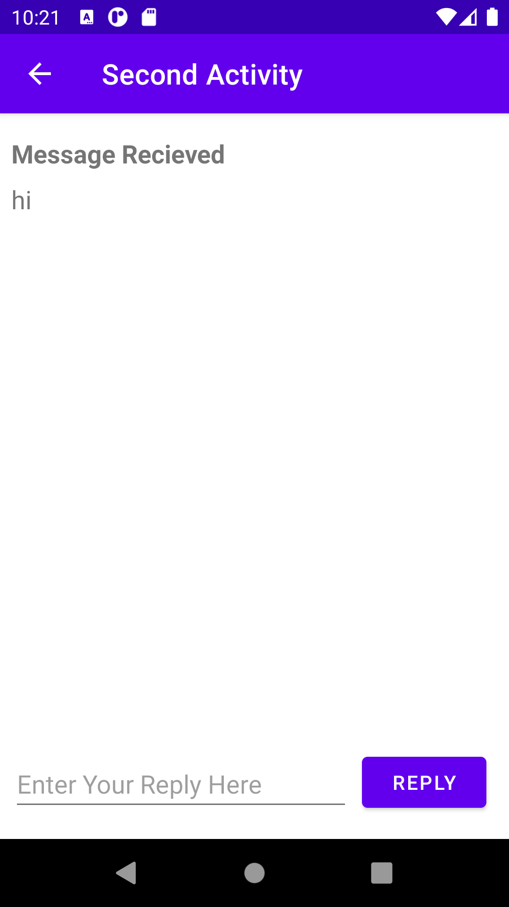
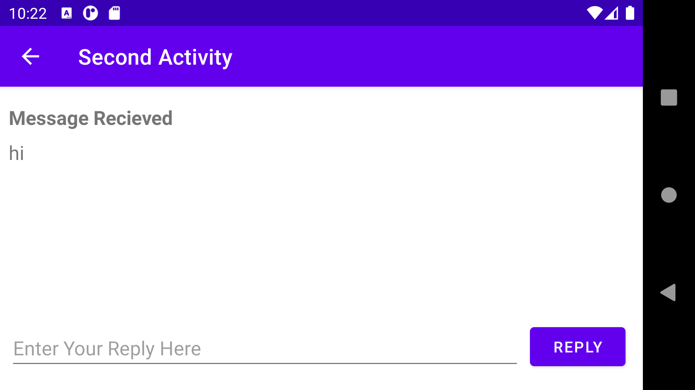
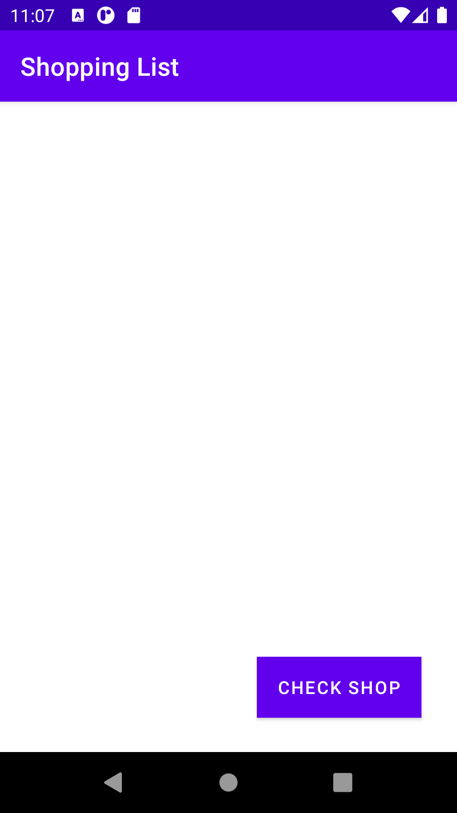
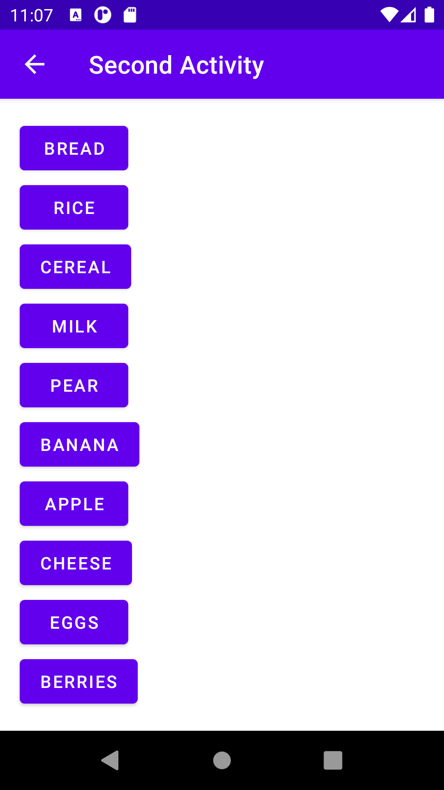
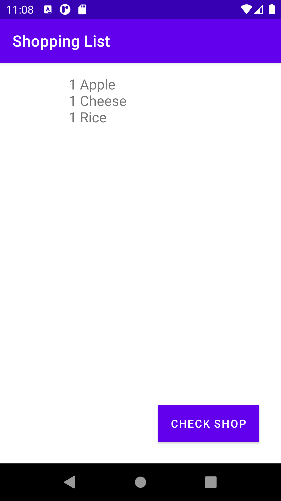
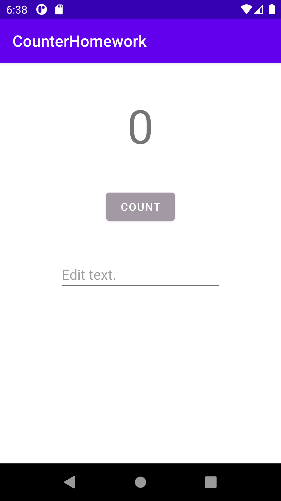
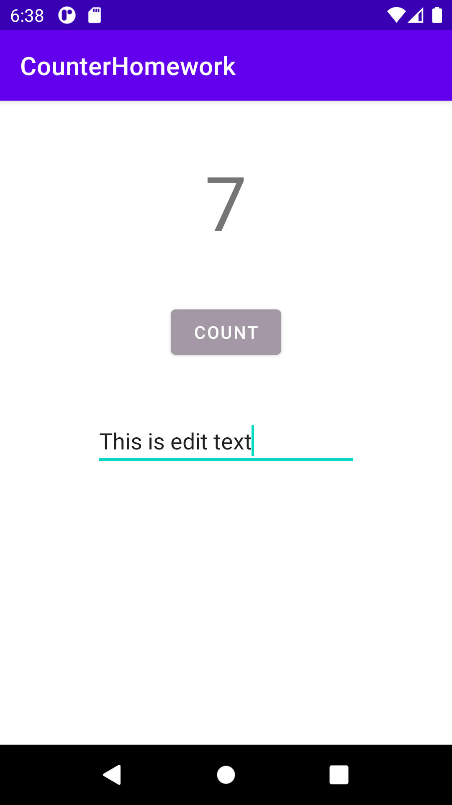

# Activity-lifecycle-and-state
<b>homework gif</b>
 

 
<b>Task1</b>
 
Callbacks
 

 
<b>Task 2</b>
 
Beforerotating
 

 
Rotated
 

 
Coding Challenge
 
Home page
 

 
List
 

 
Added list
 

 
Homework
 
Home page
 

 
After filling entries
 

 
